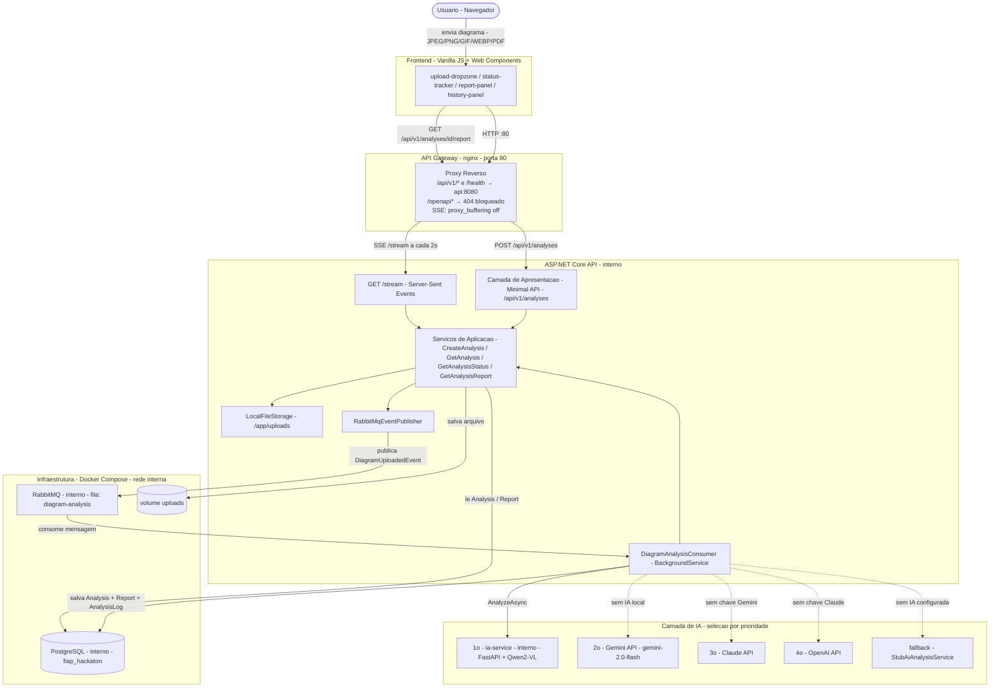

# Analisador de Diagramas de Arquitetura

**Hackathon Integrado — IA para Devs (IADT) + Software Architecture (SOAT)**  
FIAP Secure Systems · MVP

---

## O Problema

Empresas que operam sistemas distribuídos mantêm dezenas de diagramas de arquitetura armazenados como imagens ou PDFs, utilizados em revisões arquiteturais, auditorias de segurança, avaliações de escalabilidade e discussões técnicas entre times.

Esses diagramas são analisados **manualmente**, o que é:

- Demorado
- Dependente de especialistas
- Não escalável entre equipes

A **FIAP Secure Systems** decidiu criar um MVP que recebe um diagrama de arquitetura de software e retorna automaticamente uma análise técnica estruturada, com foco em componentes identificados, riscos arquiteturais e recomendações.

---

## Arquitetura Proposta

A solução segue **Clean Architecture** com abordagem de microsserviços. As responsabilidades estão divididas em serviços distintos que se comunicam via REST e mensageria assíncrona.

```
┌─────────────────┐    HTTP :80   ┌─────────────────────────────┐
│  Frontend       │ ────────────► │  nginx (API Gateway)  :80   │
│  (Vanilla JS)   │ ◄──── SSE ── │  /api/v1/* → api:8080       │
└─────────────────┘               │  /health   → api:8080       │
                                  │  /openapi* → 404 (bloqueado)│
                                  └──────────────┬──────────────┘
                                                 │ proxy reverso
                                                 ▼
                                  ┌──────────────────────────────┐
                                  │  ASP.NET Core API  (interno) │
                                  │  (Upload + Orquestração +    │
                                  │   Status + Relatório)        │
                                  └──────────────┬───────────────┘
                                                 │ publica evento
                                                 ▼
                                  ┌──────────────────────────────┐
                                  │  RabbitMQ          (interno) │
                                  │  Exchange: fiap-hackaton-ex. │
                                  │  Fila: diagram-analysis      │
                                  └──────────────┬───────────────┘
                                                 │ consome
                                                 ▼
                                  ┌──────────────────────────────┐
                                  │  DiagramAnalysisConsumer     │
                                  │  (BackgroundService)         │
                                  └──────────┬───────────────────┘
                                             │ AnalyzeAsync
                              ┌──────────────▼──────────────────────────┐
                              │       Camada de IA (ordem de prioridade)│
                              │  1. ia-service (Qwen2-VL) (interno)    │
                              │  2. Gemini API (gemini-2.0-flash)       │
                              │  3. Claude API (Anthropic)              │
                              │  4. OpenAI API                          │
                              │  5. StubAiAnalysisService (fallback)   │
                              └─────────────────────────────────────────┘
                                             │ salva resultado
                                             ▼
                                  ┌──────────────────────────────┐
                                  │  PostgreSQL        (interno) │
                                  │  Analysis · Report ·         │
                                  │  AnalysisLog                 │
                                  └──────────────────────────────┘
```

### Camadas (Clean Architecture)

| Camada | Responsabilidade |
|---|---|
| **Domain** | Entidades (`Analysis`, `Report`, `AnalysisLog`), enums, interfaces, padrão Result |
| **Application** | Serviços de caso de uso: `CreateAnalysis`, `GetAnalysis`, `GetAnalysisStatus`, `GetAnalysisReport`, `ListAnalyses` |
| **Infrastructure** | EF Core + PostgreSQL, publisher/consumer RabbitMQ, armazenamento de arquivos, adaptadores de IA |
| **Presentation** | Endpoints Minimal API do ASP.NET, middlewares (CorrelationId, ExceptionHandler) |

---

## Fluxo da Solução

1. **Upload** — o usuário envia uma imagem ou PDF pelo frontend. O navegador chama `POST /api/v1/analyses`. A API valida o arquivo (máx. 10 MB, tipos MIME permitidos), salva no volume compartilhado `uploads`, persiste um registro `Analysis` com status `Received` e publica um `DiagramUploadedEvent` no RabbitMQ.

2. **Processamento assíncrono** — o `DiagramAnalysisConsumer` (serviço em background) consome o evento da fila, marca a análise como `Processing` e aciona o provedor de IA configurado. Cada etapa do processamento é registrada em `AnalysisLog`.

3. **Análise por IA** — o provedor ativo recebe o diagrama e retorna um JSON estruturado com quatro campos: `components`, `risks`, `recommendations` e `feedback`. O resultado é persistido como entidade `Report` e o status avança para `Processed` (ou `Error` em caso de falha).

4. **Entrega do resultado** — o frontend acompanha o progresso via stream de Server-Sent Events (`GET /api/v1/analyses/stream`, atualizado a cada 2 s). Ao atingir `Processed`, busca o relatório completo em `GET /api/v1/analyses/{id}/report` e o renderiza.

### Ciclo de vida do status da análise

```
Received ──► Processing ──► Processed
                  │
                  └────────► Error
```

---

## Referência da API

URL base: `http://localhost/api/v1`

| Método | Rota | Descrição |
|---|---|---|
| `GET` | `/health` | Verificação de saúde |
| `POST` | `/analyses` | Envia um diagrama para análise |
| `GET` | `/analyses` | Lista todas as análises (mais recentes primeiro) |
| `GET` | `/analyses/stream` | Stream SSE — lista completa enviada a cada 2 s |
| `GET` | `/analyses/{id}` | Detalhes de uma análise |
| `GET` | `/analyses/{id}/status` | Status atual do processamento |
| `GET` | `/analyses/{id}/report` | Relatório gerado pela IA |

Tipos de arquivo aceitos: `image/jpeg`, `image/png`, `image/gif`, `image/webp`, `application/pdf`  
Tamanho máximo: **10 MB**

---

## Diagrama de Arquitetura (Mermaid)



---

## Segurança

### 1. Validação de entradas e tratamento de dados não confiáveis

Todos os arquivos são validados na fronteira da API antes de qualquer processamento:

- **Tamanho do arquivo** limitado a **10 MB**. Requisições acima desse limite são rejeitadas com `400 Bad Request` antes mesmo de ler o stream.
- **Lista de permissão de tipos MIME**: apenas `image/jpeg`, `image/png`, `image/gif`, `image/webp` e `application/pdf` são aceitos. Qualquer outro tipo de conteúdo é rejeitado imediatamente.
- **Validação de domínio** via padrão Result em toda a camada de aplicação — erros são retornados como valores tipados `DomainError` em vez de exceções lançadas, prevenindo transições de estado inesperadas.
- O `ExceptionHandlerMiddleware` captura todas as exceções não tratadas e retorna uma resposta JSON estruturada (`title`, `status`, `correlationId`) **sem expor stack traces ou detalhes internos** ao chamador.

### 2. Uso controlado dos modelos de IA — escopo, previsibilidade e guardrails

O pipeline de IA impõe controle estrito de saída em todas as etapas:

- **Prompt engineering com restrição de esquema**: todo provedor de IA recebe um prompt que instrui o modelo a retornar *apenas* um objeto JSON válido com exatamente quatro chaves (`components`, `risks`, `recommendations`, `feedback`). Sem texto livre, sem markdown, sem preâmbulo.
- **Guardrails de parsing de saída**: a função `_parse` no `ia-service` remove delimitadores de markdown e tenta `json.loads`. Se o parsing falhar, um extrator baseado em regex recupera os campos individualmente, evitando que uma resposta malformada do modelo se propague como erro não tratado.
- **Limite de tokens**: `MAX_NEW_TOKENS=1024` (modelo local) e `max_tokens=1500` (Claude API) limitam o tamanho máximo da resposta, prevenindo geração descontrolada.
- **Decodificação determinística**: o modelo Qwen2-VL local é invocado com `do_sample=False` (decodificação gulosa), eliminando aleatoriedade da saída e melhorando a consistência das respostas para entradas idênticas.
- **Isolamento de escopo**: o prompt não permite que o modelo solicite recursos externos, execute código ou produza conteúdo fora dos quatro campos definidos.

### 3. Tratamento seguro de falhas e comportamentos inesperados da IA

- **Rastreamento de status**: se a chamada à IA lançar qualquer exceção, o `DiagramAnalysisConsumer` a captura, registra a mensagem de erro em `AnalysisLog` e marca a `Analysis` como `Error`. O sistema nunca descarta falhas silenciosamente.
- **Tratamento de dead-letter**: se uma mensagem do RabbitMQ não puder ser desserializada, ela é NACKada com `requeue: false`, impedindo que mensagens envenenadas reentrem na fila indefinidamente.
- **Backoff exponencial**: erros de rate limit (HTTP 429) de provedores externos (Gemini: até 5 tentativas; Claude: até 4 tentativas) são retentados com backoff exponencial, evitando sobrecarga em cascata.
- **Cadeia de fallback de provedores**: se o provedor de IA principal estiver indisponível ou não configurado, o sistema automaticamente recorre ao próximo disponível (Local → Gemini → Claude → OpenAI → Stub), garantindo degradação controlada do pipeline.

### 4. Práticas de segurança na comunicação entre serviços

- **Política de CORS**: a API impõe uma lista de origens permitidas via configuração `Cors:AllowedOrigins`, restringindo requisições cross-origin a frontends conhecidos.
- **Correlation ID**: o `CorrelationIdMiddleware` lê ou gera um `X-Correlation-Id` em cada requisição, injeta nos escopos de log e o devolve no cabeçalho da resposta — habilitando rastreamento completo entre serviços.
- **Entrega persistente de mensagens**: mensagens do RabbitMQ são publicadas com `DeliveryMode = Persistent`, garantindo que eventos sobrevivam a reinicializações do broker.
- **Redirecionamento HTTPS**: a API está configurada com `UseHttpsRedirection()` para que requisições em texto plano sejam promovidas automaticamente.
- **Mensagens JSON estruturadas**: todas as mensagens entre serviços são serializadas em JSON com cabeçalho explícito `Content-Type: application/json`.

### 5. Riscos e limitações de segurança conhecidos

| Risco | Descrição | Status de mitigação |
|---|---|---|
| Sem autenticação / autorização | Endpoints da API são públicos — qualquer chamador pode enviar e ler análises | Escopo do MVP; camada de autenticação ainda não implementada |
| Chaves de API em variáveis de ambiente | Chaves do Gemini, Claude e OpenAI são passadas via ambiente no `docker-compose.yml` | Chaves nunca são commitadas no código; `.env.example` fornecido como referência |
| Armazenamento de arquivos sem criptografia em repouso | Diagramas enviados ficam em volume Docker local sem criptografia | Aceitável para o MVP; object storage em nuvem com criptografia server-side é recomendado para produção |
| Credenciais padrão do RabbitMQ | Ambiente de desenvolvimento usa `guest`/`guest` | Deve ser substituído por credenciais fortes em qualquer ambiente não local |
| Sem filtragem de conteúdo na saída da IA | Os campos `components`/`risks` do modelo são armazenados e renderizados como recebidos | Restrição de esquema JSON e limite de tokens reduzem o risco; sanitização de saída recomendada para produção |
| Modelo local sem isolamento de processo | Qwen2-VL roda no mesmo container que o processo FastAPI | Deploy em produção deve isolar a inferência em um nó GPU dedicado |

---

## Instruções de Execução

### Pré-requisitos

- [Docker](https://www.docker.com/) e Docker Compose v2+
- Pelo menos **6 GB de RAM livre** (o modelo Qwen2-VL local requer ~4 GB na primeira carga)
- *(Opcional)* Uma chave de API do Gemini, Claude ou OpenAI, caso prefira um modelo em nuvem

### Executando com Docker Compose

```bash
# 1. Clone o repositório
git clone <url-do-repositorio>
cd fiap-hackaton

# 2. Inicie todos os serviços
docker compose up --build
```

Na primeira execução, o `ia-service` local fará o download do modelo Qwen2-VL-2B (~4 GB). Execuções subsequentes reutilizam os pesos em cache do volume `hf_cache`.

### URLs dos serviços

| Serviço | URL |
|---|---|
| **API Gateway (nginx)** | http://localhost |
| Frontend | abra `frontend/index.html` no navegador |
| Painel do RabbitMQ | http://localhost:15672 (guest / guest) |
| API (interno) | `api:8080` — não exposto ao host |
| ia-service (interno) | `ia-service:8000` — não exposto ao host |
| PostgreSQL (interno) | `postgres:5432` — não exposto ao host |

### Trocando o provedor de IA

Edite o ambiente do serviço `api` no `docker-compose.yml`:

```yaml
# Usar Qwen2-VL local (padrão — maior prioridade)
LocalAi__BaseUrl: http://ia-service:8000

# Usar Gemini (comente LocalAi__BaseUrl)
Gemini__ApiKey: <sua-chave>
Gemini__Model: gemini-2.0-flash

# Usar Claude
Anthropic__ApiKey: <sua-chave>

# Usar OpenAI
OpenAI__ApiKey: <sua-chave>
```

A seleção do provedor é automática: a primeira chave configurada é utilizada.

### Executando os testes

```bash
cd src
dotnet test
```

---

## Serviços e Portas

| Serviço | Runtime | Porta interna | Porta no host |
|---|---|---|---|
| `nginx` | nginx:alpine | 80 | **80** |
| `api` | ASP.NET Core (.NET 10) | 8080 | — (interno) |
| `ia-service` | FastAPI + Qwen2-VL (Python 3.11) | 8000 | — (interno) |
| `postgres` | postgres:16-alpine | 5432 | — (interno) |
| `rabbitmq` | rabbitmq:3.13-management-alpine | 5672 / 15672 | 15672 (UI dev) |

---

## Observabilidade

- **Logs estruturados** via `ILogger<T>` com escopo de `CorrelationId` em todas as requisições
- **Progresso por etapa** armazenado em `AnalysisLog` (nível + mensagem por estágio de processamento)
- **Endpoint de health** em `GET /health` retorna `{ status: "healthy", timestamp }` para probes de liveness
- **Correlation ID** propagado via cabeçalho `X-Correlation-Id` em todas as requisições e respostas
