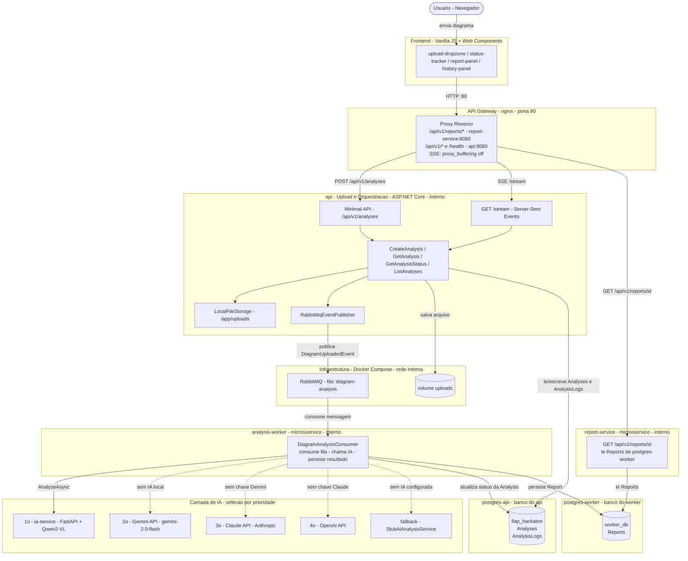

# Analisador de Diagramas de Arquitetura

**Hackathon Integrado — IA para Devs (IADT) + Software Architecture (SOAT)**  
FIAP Secure Systems · MVP

---

## O Problema

Empresas que operam sistemas distribuídos mantêm dezenas de diagramas de arquitetura armazenados como imagens ou PDFs, utilizados em revisões arquiteturais, auditorias de segurança, avaliações de escalabilidade e discussões técnicas entre times.

Esses diagramas são analisados **manualmente**, o que é:

- Demorado
- Dependente de especialistas
- Não escalável entre equipes

A **FIAP Secure Systems** decidiu criar um MVP que recebe um diagrama de arquitetura de software e retorna automaticamente uma análise técnica estruturada, com foco em componentes identificados, riscos arquiteturais e recomendações.

---

## Arquitetura

A solução segue **Clean Architecture** com **microsserviços independentes**, cada um com seu próprio banco de dados, comunicando-se via mensageria assíncrona (RabbitMQ).

```
┌─────────────────┐    HTTP :80    ┌─────────────────────────────────────────────────┐
│  Frontend       │ ─────────────► │  nginx  (API Gateway)  :80                      │
│  (Vanilla JS)   │ ◄──── SSE ─── │  /api/v1/reports/* → report-service:8080        │
└─────────────────┘                │  /api/v1/*          → api:8080                  │
                                   │  /health            → api:8080                  │
                                   └──────┬──────────────────────┬───────────────────┘
                                          │ /api/v1/             │ /api/v1/reports/
                                          ▼                      ▼
                           ┌──────────────────────┐  ┌─────────────────────────────┐
                           │  api  (interno)       │  │  report-service  (interno)  │
                           │  Upload + Orquestração│  │  GET /api/v1/reports/{id}   │
                           │  + Status tracking    │  └────────────┬────────────────┘
                           └──────┬────────┬───────┘               │ lê Reports
                                  │        │ lê/escreve            ▼
                            publica        │            ┌──────────────────────┐
                            evento         ▼            │  postgres-worker     │
                                  │  ┌──────────────┐  │  (banco do worker)   │
                                  │  │postgres-api  │  │  worker_db           │
                                  │  │(banco da api)│  │  Reports             │
                                  │  │fiap_hackaton │  └──────────┬───────────┘
                                  │  │Analyses      │             │ escreve Reports
                                  │  │AnalysisLogs  │             │
                                  ▼  └──────────────┘             │
                           ┌──────────────────────┐               │
                           │  RabbitMQ  (interno) │               │
                           │  fila: diagram-anal. │               │
                           └──────────┬───────────┘               │
                                      │ consome                   │
                                      ▼                           │
                           ┌──────────────────────────────────────┘
                           │  analysis-worker  (interno)
                           │  · lê/atualiza status em postgres-api
                           │  · persiste Report em postgres-worker
                           └──────────┬───────────┘
                                      │ AnalyzeAsync
                     ┌────────────────▼────────────────────────────────┐
                     │         Camada de IA  (ordem de prioridade)      │
                     │  1. ia-service  (Qwen2-VL)         (interno)    │
                     │  2. Gemini API  (gemini-2.0-flash)               │
                     │  3. Claude API  (Anthropic)                      │
                     │  4. OpenAI API                                   │
                     │  5. StubAiAnalysisService          (fallback)   │
                     └─────────────────────────────────────────────────┘
```

### Separação de bancos de dados (database-per-service)

| Instância | Container | Banco | Dono | Tabelas |
|---|---|---|---|---|
| **postgres-api** | `fiap-hackaton-postgres-api` | `fiap_hackaton` | `api` | `Analyses`, `AnalysisLogs` |
| **postgres-worker** | `fiap-hackaton-postgres-worker` | `worker_db` | `analysis-worker` (escrita) · `report-service` (leitura) | `Reports` |

> **Trade-off documentado:** o `analysis-worker` acessa dois bancos — `postgres-api` para atualizar o status da `Analysis` e `postgres-worker` para persistir o `Report`. Isso é necessário porque o ciclo de vida da análise (propriedade do `api`) e o resultado da IA (propriedade do worker) pertencem a contextos bounded distintos. A alternativa estrita seria o worker publicar um evento de retorno ao `api`; optou-se pela leitura direta para simplificar o MVP sem sacrificar a separação de dados em repouso.

### Camadas (Clean Architecture)

| Camada | Responsabilidade |
|---|---|
| **Domain** | Entidades (`Analysis`, `Report`, `AnalysisLog`), enums, interfaces, padrão Result |
| **Application** | Casos de uso: `CreateAnalysis`, `GetAnalysis`, `GetAnalysisStatus`, `GetAnalysisReport`, `ListAnalyses` |
| **Infrastructure** | EF Core + PostgreSQL (`AppDbContext` / `WorkerDbContext`), RabbitMQ publisher/consumer, armazenamento de arquivos, adaptadores de IA |
| **Presentation** | Endpoints Minimal API do ASP.NET Core, middlewares (`CorrelationId`, `ExceptionHandler`) |

---

## Estrutura do Repositório

```
fiap-hackaton/
├── services/                        # Microsserviços da aplicação
│   ├── api/                         # API principal — upload, orquestração, status (ASP.NET Core)
│   │   ├── Domain/                  # Entidades, interfaces, enums, eventos
│   │   ├── Application/             # Casos de uso (CreateAnalysis, GetAnalysis, …)
│   │   ├── Infrastructure/          # EF Core, RabbitMQ, armazenamento, adaptadores de IA
│   │   ├── Presentation/            # Endpoints Minimal API, middlewares
│   │   ├── fiap-hackaton.Tests/     # Testes unitários e de integração (.NET)
│   │   ├── fiap-hackaton.csproj
│   │   ├── fiap-hackaton.sln
│   │   └── Dockerfile
│   ├── analysis-worker/             # Worker assíncrono — consome fila, aciona IA, persiste resultado
│   │   ├── Program.cs
│   │   ├── analysis-worker.csproj
│   │   └── Dockerfile
│   ├── report-service/              # Microsserviço de leitura — entrega relatórios ao frontend
│   │   ├── Program.cs
│   │   ├── report-service.csproj
│   │   └── Dockerfile
│   └── ia-service/                  # Serviço de IA local — FastAPI + Qwen2-VL (Python 3.11)
│       ├── app/                     # main.py, analyzer.py, schemas.py, config.py
│       ├── tests/                   # Testes pytest
│       ├── requirements.txt
│       └── Dockerfile
├── frontend/                        # Interface web — Vanilla JS + Web Components
│   ├── index.html
│   ├── app.js
│   ├── components/                  # upload-dropzone, status-tracker, report-panel, …
│   ├── modules/                     # api.js, polling.js, theme.js, toast.js
│   └── styles/
├── infra/                           # Configurações de infraestrutura
│   ├── nginx/nginx.conf             # API Gateway — roteamento e SSE
│   └── postgres/init.sql            # Criação do banco worker_db
├── docs/                            # Documentação adicional e slides
├── docker-compose.yml               # Orquestração de todos os 8 serviços
└── Directory.Build.props            # Configurações globais MSBuild
```

---

## Fluxo da Solução

1. **Upload** — o usuário envia uma imagem ou PDF pelo frontend. O navegador chama `POST /api/v1/analyses`. A API valida o arquivo (máx. 10 MB, tipos MIME permitidos), salva no volume compartilhado `uploads`, persiste um registro `Analysis` com status `Received` em `postgres-api` e publica um `DiagramUploadedEvent` no RabbitMQ.

2. **Processamento assíncrono** — o `analysis-worker` consome o evento da fila, atualiza o status para `Processing` em `postgres-api` e aciona o provedor de IA configurado. Cada etapa é registrada em `AnalysisLog`.

3. **Análise por IA** — o provedor ativo recebe o diagrama e retorna um JSON estruturado com quatro campos: `components`, `risks`, `recommendations` e `feedback`. O resultado é persistido como `Report` em `postgres-worker` e o status da análise avança para `Processed` (ou `Error` em caso de falha).

4. **Entrega do resultado** — o frontend acompanha o progresso via Server-Sent Events (`GET /api/v1/analyses/stream`, atualizado a cada 2 s). Ao atingir `Processed`, busca o relatório em `GET /api/v1/reports/{id}` — roteado pelo nginx para o `report-service`, que lê diretamente de `postgres-worker`.

### Ciclo de vida do status da análise

```
Received ──► Processing ──► Processed
                  │
                  └────────► Error
```

---

## Referência da API

URL base: `http://localhost/api/v1`

| Método | Rota | Serviço | Descrição |
|---|---|---|---|
| `GET` | `/health` | api | Verificação de saúde |
| `POST` | `/analyses` | api | Envia um diagrama para análise |
| `GET` | `/analyses` | api | Lista todas as análises (mais recentes primeiro) |
| `GET` | `/analyses/stream` | api | Stream SSE — lista completa enviada a cada 2 s |
| `GET` | `/analyses/{id}` | api | Detalhes de uma análise |
| `GET` | `/analyses/{id}/status` | api | Status atual do processamento |
| `GET` | `/reports/{id}` | report-service | Relatório gerado pela IA |

Tipos de arquivo aceitos: `image/jpeg`, `image/png`, `image/gif`, `image/webp`, `application/pdf`  
Tamanho máximo: **10 MB**

---

## Diagrama de Arquitetura (Mermaid)



---

## Serviços e Portas

| Serviço | Runtime | Responsabilidade | Porta interna | Porta no host |
|---|---|---|---|---|
| `nginx` | nginx:alpine | API Gateway / Proxy reverso | 80 | **80** |
| `api` | ASP.NET Core (.NET 10) | Upload, Orquestração, Status | 8080 | — (interno) |
| `analysis-worker` | ASP.NET Core (.NET 10) | Processamento assíncrono de IA | — | — (interno) |
| `report-service` | ASP.NET Core (.NET 10) | Entrega de relatórios | 8080 | — (interno) |
| `ia-service` | FastAPI + Qwen2-VL (Python 3.11) | Modelo local de IA | 8000 | — (interno) |
| `postgres-api` | postgres:16-alpine | Banco do `api` (`fiap_hackaton`) | 5432 | — (interno) |
| `postgres-worker` | postgres:16-alpine | Banco do worker/report-service (`worker_db`) | 5432 | — (interno) |
| `rabbitmq` | rabbitmq:3.13-management-alpine | Mensageria assíncrona | 5672 / 15672 | **15672** (UI dev) |

---

## Segurança

### 1. Validação de entradas e tratamento de dados não confiáveis

Todos os arquivos são validados na fronteira da API antes de qualquer processamento:

- **Tamanho do arquivo** limitado a **10 MB**. Requisições acima desse limite são rejeitadas com `400 Bad Request` antes mesmo de ler o stream.
- **Lista de permissão de tipos MIME**: apenas `image/jpeg`, `image/png`, `image/gif`, `image/webp` e `application/pdf` são aceitos.
- **Validação de domínio** via padrão Result em toda a camada de aplicação — erros são retornados como valores tipados `DomainError` em vez de exceções lançadas.
- O `ExceptionHandlerMiddleware` captura todas as exceções não tratadas e retorna uma resposta JSON estruturada (`title`, `status`, `correlationId`) **sem expor stack traces** ao chamador.

### 2. Uso controlado dos modelos de IA — escopo, previsibilidade e guardrails

- **Prompt engineering com restrição de esquema**: todo provedor de IA recebe um prompt que instrui o modelo a retornar *apenas* um objeto JSON válido com exatamente quatro chaves (`components`, `risks`, `recommendations`, `feedback`).
- **Guardrails de parsing de saída**: a função `_parse` no `ia-service` remove delimitadores de markdown e tenta `json.loads`. Se o parsing falhar, um extrator baseado em regex recupera os campos individualmente.
- **Limite de tokens**: `MAX_NEW_TOKENS=1024` (modelo local) e `max_tokens=1500` (Claude API) limitam o tamanho máximo da resposta.
- **Decodificação determinística**: o modelo Qwen2-VL local é invocado com `do_sample=False` (decodificação gulosa), melhorando a consistência das respostas.

### 3. Tratamento seguro de falhas

- **Rastreamento de status**: se a chamada à IA falhar, o `DiagramAnalysisConsumer` registra o erro em `AnalysisLog` e marca a `Analysis` como `Error`. O sistema nunca descarta falhas silenciosamente.
- **Tratamento de dead-letter**: mensagens não deserializáveis são NACKadas com `requeue: false`, impedindo mensagens envenenadas de reingressar na fila.
- **Backoff exponencial**: erros de rate limit de provedores externos são retentados com backoff exponencial.
- **Cadeia de fallback de provedores**: Local → Gemini → Claude → OpenAI → Stub.

### 4. Práticas de segurança na comunicação entre serviços

- **Política de CORS**: a API e o `report-service` impõem lista de origens permitidas via `Cors:AllowedOrigins`.
- **Correlation ID**: propagado via `X-Correlation-Id` em todas as requisições, injetado nos escopos de log e retornado no cabeçalho da resposta.
- **Entrega persistente de mensagens**: mensagens do RabbitMQ são publicadas com `DeliveryMode = Persistent`.
- **Mensagens JSON estruturadas**: todas as mensagens entre serviços são serializadas em JSON com `Content-Type: application/json`.

### 5. Riscos e limitações conhecidos

| Risco | Descrição | Status de mitigação |
|---|---|---|
| Sem autenticação / autorização | Endpoints são públicos | Escopo do MVP; autenticação não implementada |
| Chaves de API em variáveis de ambiente | Chaves passadas via `docker-compose.yml` | Chaves nunca commitadas no código |
| Armazenamento sem criptografia em repouso | Diagramas em volume Docker local | Aceitável para MVP; object storage recomendado para produção |
| Credenciais padrão do RabbitMQ | Usa `guest`/`guest` | Substituir em qualquer ambiente não local |
| Sem filtragem de conteúdo na saída da IA | Campos do modelo renderizados como recebidos | Restrição de esquema e limite de tokens reduzem o risco |

---

## Instruções de Execução

### Pré-requisitos

| Ferramenta | Versão mínima | Observação |
|---|---|---|
| [Docker](https://www.docker.com/) + Docker Compose | v2+ | incluso no Docker Desktop |
| RAM livre | 6 GB | o modelo Qwen2-VL local requer ~4 GB na primeira carga |
| Chave de API *(opcional)* | — | Gemini, Claude ou OpenAI como alternativa ao modelo local |

### 1. Clonar o repositório

```bash
git clone <url-do-repositorio>
cd fiap-hackaton
```

### 2. (Opcional) Configurar provedor de IA

Por padrão, o `analysis-worker` usa o **Claude (Anthropic)**. Para trocar, edite o bloco `environment` do serviço `analysis-worker` em `docker-compose.yml`:

```yaml
# Opção 1 — Qwen2-VL local (sem custo, ~4 GB de download na 1ª execução)
LocalAi__BaseUrl: http://ia-service:8000

# Opção 2 — Gemini
Gemini__ApiKey: <sua-chave>
Gemini__Model: gemini-2.0-flash

# Opção 3 — Claude (Anthropic) ← padrão atual
Anthropic__ApiKey: <sua-chave>
Anthropic__Model: claude-sonnet-4-6

# Opção 4 — OpenAI
OpenAI__ApiKey: <sua-chave>
OpenAI__Model: gpt-4o
```

A seleção é automática por prioridade: Local → Gemini → Claude → OpenAI → Stub (mock).  
Deixe todas as chaves em branco para usar o Stub (retorna dados fixos, sem IA real).

### 3. Subir os serviços

```bash
docker compose up --build
```

Na primeira execução o Docker vai:
1. Compilar as imagens .NET e Python
2. Baixar o modelo Qwen2-VL-2B (~4 GB) se `ia-service` estiver habilitado
3. Aplicar as migrations do banco de dados automaticamente

As próximas execuções são mais rápidas pois as imagens e o modelo ficam em cache.

### 4. Abrir o frontend

O frontend é um arquivo HTML estático — **abra diretamente no navegador**:

```
frontend/index.html
```

A página se conecta ao API Gateway em `http://localhost` (porta 80, servida pelo nginx).

### URLs disponíveis após o `docker compose up`

| Serviço | URL | Acesso |
|---|---|---|
| **Frontend** | `frontend/index.html` (arquivo local) | público |
| **API Gateway (nginx)** | http://localhost | público |
| **Painel RabbitMQ** | http://localhost:15672 · `guest` / `guest` | dev only |
| api | `api:8080` | interno |
| analysis-worker | — | interno (sem porta) |
| report-service | `report-service:8080` | interno |
| ia-service | `ia-service:8000` | interno |
| postgres-api | `postgres-api:5432` | interno |
| postgres-worker | `postgres-worker:5432` | interno |

### Executando os testes

**Testes .NET** (unitários + integração):

```bash
dotnet test services/api/fiap-hackaton.sln
```

**Testes Python** (ia-service):

```bash
pip install -r services/ia-service/requirements-test.txt
cd services/ia-service
pytest --tb=short
```

---

## Observabilidade

- **Logs estruturados** via `ILogger<T>` com escopo de `CorrelationId` em todas as requisições
- **Progresso por etapa** armazenado em `AnalysisLog` (nível + mensagem por estágio de processamento)
- **Endpoint de health** em `GET /health` retorna `{ status: "healthy", timestamp }` para probes de liveness
- **Correlation ID** propagado via `X-Correlation-Id` em todas as requisições e respostas
