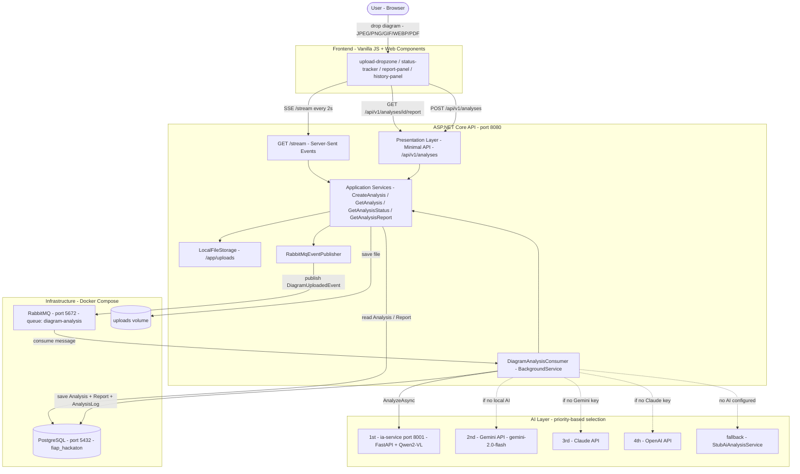

# Architecture Diagram

## Flow description

1. **Upload** — the user drops an image or PDF onto the frontend. The browser calls `POST /api/v1/analyses`, which validates the file (≤ 10 MB, allowed MIME types), saves it to the shared `uploads` volume, persists an `Analysis` record (status `Received`), and publishes a `DiagramUploadedEvent` to RabbitMQ.

2. **Async processing** — the `DiagramAnalysisConsumer` background service dequeues the event, sets status → `Processing`, and calls the configured AI provider (priority: Local → Gemini → Claude → OpenAI → Stub). Progress is written step-by-step to `AnalysisLog`.

3. **AI analysis** — the selected provider receives the diagram, runs inference, and returns structured JSON: `components`, `risks`, `recommendations`, `feedback`. The result is stored as a `Report` entity and status is set to `Processed` (or `Error` on failure).

4. **Result delivery** — the frontend polls status via the SSE stream (`/api/v1/analyses/stream`, every 2 s). Once `Processed`, it fetches the full report from `GET /api/v1/analyses/{id}/report` and renders it.

## Services & ports

| Service | Image / Runtime | Port |
|---|---|---|
| `api` | ASP.NET Core (.NET 10) | 8080 |
| `ia-service` | FastAPI + Qwen2-VL (Python) | 8001 → 8000 |
| `postgres` | postgres:16-alpine | 5432 |
| `rabbitmq` | rabbitmq:3.13-management-alpine | 5672, 15672 |
